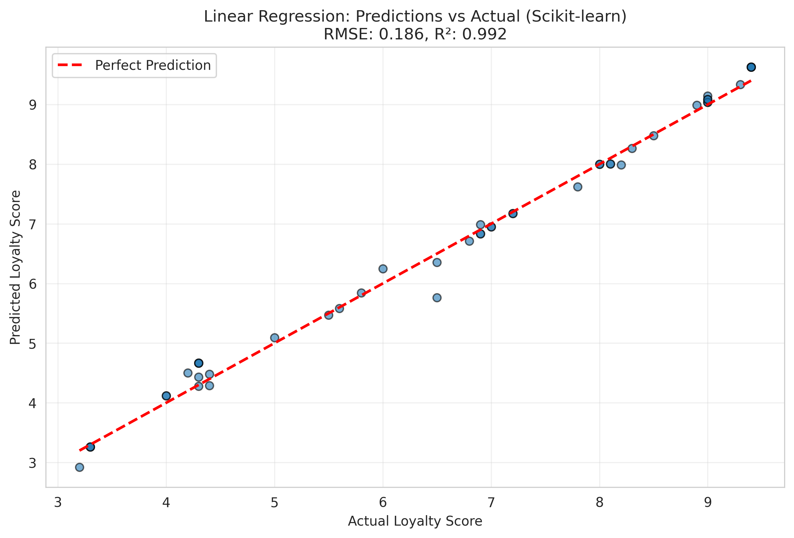
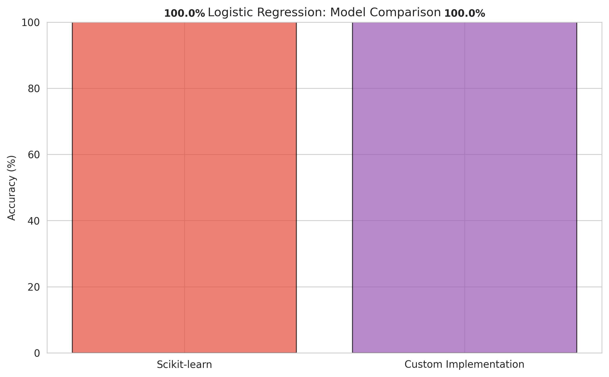
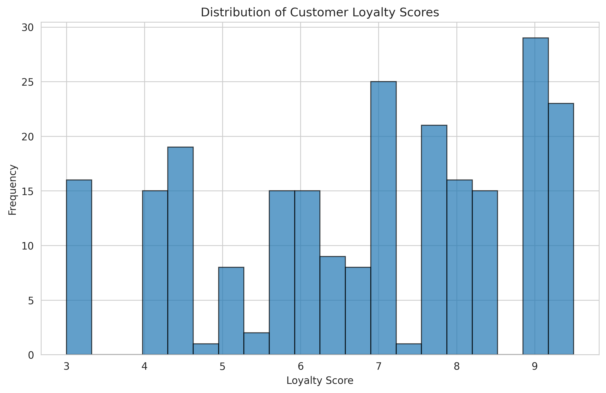

# Assignment 1: Linear and Logistic Regression

**CS3735 - Introduction to Machine Learning | Winter 2024**

## Overview

This assignment explores linear and logistic regression through both library implementations and from-scratch coding.

**Part 1:** used scikit-learn to establish baseline performance on two datasets: customer loyalty prediction (regression) and Iris species classification (multi-class).

**Part 2:** implemented the core algorithms from scratch using gradient descent to deepen understanding of how these models work under the hood.

## Datasets

### Customer Purchasing Behaviors
- **Size:** 238 samples, 7 features
- **Target:** `loyalty_score` (continuous, 3-9 range)
- **Features:** age, annual_income, purchase_amount, purchase_frequency, region
- **Task:** Regression - predict customer loyalty score
- **Source:** [Kaggle - Customer Purchasing Behaviors](https://www.kaggle.com/datasets/hanaksoy/customer-purchasing-behaviors)

### Iris Dataset
- **Size:** 150 samples, 4 features
- **Target:** `Species` (3 classes: Setosa, Versicolor, Virginica)
- **Features:** SepalLengthCm, SepalWidthCm, PetalLengthCm, PetalWidthCm
- **Task:** Multi-class classification
- **Source:** [Kaggle - Iris Dataset](https://www.kaggle.com/datasets/uciml/iris)

## Implementation

### Part 1: Scikit-learn Implementation
- Used `LinearRegression` for customer loyalty prediction
- Used `LogisticRegression` for Iris classification
- Applied standard preprocessing (one-hot encoding, train-test split)

### Part 2: Custom Implementation
- **Linear Regression:** Implemented gradient descent from scratch
  - Used batch gradient descent with normalized features
  - Learning rate: 0.01, Epochs: 5000
  
- **Logistic Regression:** Implemented One-vs-Rest multi-class strategy
  - Trained 3 binary classifiers (one per class)
  - Used sigmoid activation and gradient descent
  - Learning rate: 0.1, Epochs: 1000

## Results

### Linear Regression (Customer Loyalty Prediction)

| Implementation | RMSE | R² Score |
|----------------|------|----------|
| Scikit-learn   | 0.1860 | 0.9916 |
| Custom (from scratch) | 0.2011 | - |

The custom implementation achieved very similar performance to scikit-learn, with only a 0.015 difference in RMSE. This demonstrates that the gradient descent algorithm was implemented correctly.

*Scikit-learn predictions closely match actual loyalty scores*

*RMSE comparison: Custom implementation is competitive with scikit-learn*

### Logistic Regression (Iris Classification)

| Implementation | Accuracy | Precision | Recall | F1-Score |
|----------------|----------|-----------|--------|----------|
| Scikit-learn   | 100.0% | 1.00 | 1.00 | 1.00 |
| Custom (from scratch) | 100.0% | 1.00 | 1.00 | 1.00 |

Both implementations achieved perfect classification on the test set. The Iris dataset is well-suited for linear classification, as the three species are clearly separable in the feature space.

*The three Iris species show clear separation in petal dimensions*

*Perfect classification: All 30 test samples correctly predicted*

*Both implementations achieved 100% accuracy*

## Data Analysis

### Customer Data Insights

*Customer loyalty scores are roughly normally distributed around 6*

*Strong correlation between purchase amount, frequency, and loyalty score*

Key findings:
- `purchase_amount` and `purchase_frequency` have strong positive correlation with `loyalty_score`
- `annual_income` shows moderate correlation
- Feature normalization was critical for gradient descent convergence

## Key Learnings

### Technical Concepts
- **Gradient Descent:** Implemented batch gradient descent and learned the importance of learning rate tuning
- **Feature Normalization:** Discovered that normalizing features (z-score) is essential when features have different scales
- **One-vs-Rest Strategy:** Understood how to extend binary classification to multi-class problems
- **Hyperparameter Tuning:** Learning rate and epochs significantly affect convergence

### Practical Insights
- Custom implementations perform similarly to optimized libraries when properly tuned
- Scikit-learn uses more sophisticated optimization (e.g., L-BFGS) for faster convergence
- High accuracy doesn't always mean a model is good - Iris is an "easy" dataset
- Visualization is crucial for understanding model performance

## How to Run

Download the `.ipynb` files and open in Google Colab. Upload the datasets (`Iris.csv` and `Customer Purchasing Behaviors.csv`) when prompted, then run all cells.

## Technologies Used

- **Python 3.x**
- **NumPy** - Numerical computing and linear algebra
- **Pandas** - Data manipulation and analysis
- **Scikit-learn** - Machine learning library for comparison
- **Matplotlib & Seaborn** - Data visualization
- **Google Colab** - Development environment

---

**Course:** CS3735 - Introduction to Machine Learning  
**Semester:** Winter 2024  
**Institution:** University of New Brunswick
