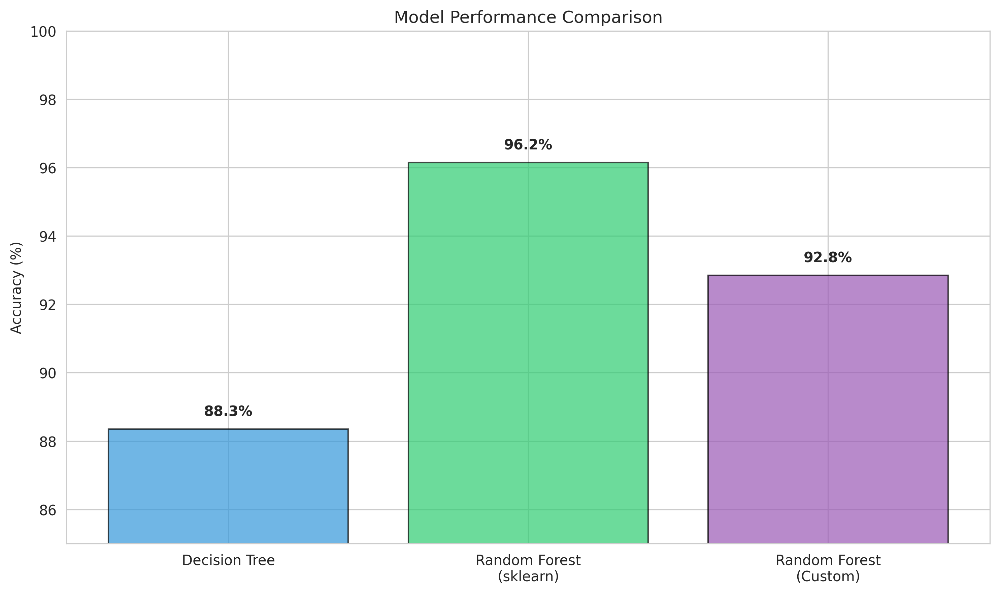
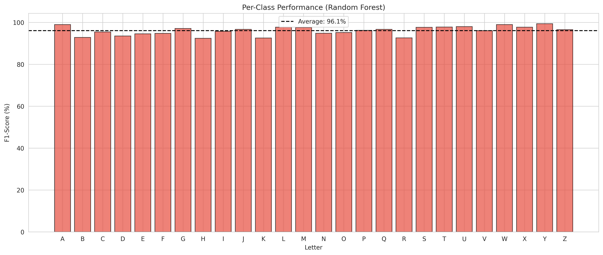
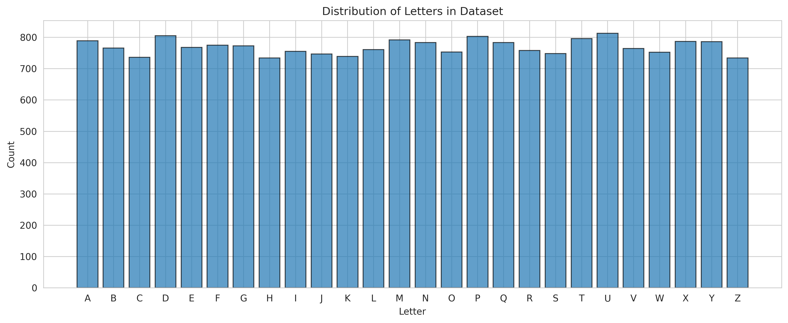

# Assignment 2: Decision Trees and Random Forests

**CS3735 - Introduction to Machine Learning | Winter 2025**

## Overview

This assignment explores tree-based learning algorithms through both library implementations and from-scratch coding.

**Part 1** used scikit-learn to establish baseline performance with Decision Trees and Random Forests on the Letter Recognition dataset.

**Part 2** implemented Random Forest from scratch, including proper feature subset selection and bootstrap sampling, to understand ensemble learning principles.

## Dataset

### Letter Recognition
- **Size:** 20,000 samples
- **Features:** 16 numerical attributes (x1-x16) representing statistical moments and edge counts of letter images
- **Target:** `lettr` - 26 classes (A-Z uppercase letters)
- **Task:** Multi-class classification
- **Source:** [UCI Machine Learning Repository](https://archive.ics.uci.edu/dataset/59/letter+recognition)

**Data Characteristics:**
- All features are numerical (no preprocessing needed)
- No missing values
- Balanced dataset (~770 samples per letter)
- Challenging task due to visual similarity between some letters (e.g., I vs J, O vs Q)

## Implementation

### Part 1: Scikit-learn Implementation

**Decision Tree Classifier**
- Standard sklearn implementation
- Binary splits based on information gain
- No depth limit (grows until pure leaves)

**Random Forest Classifier**
- 100 trees (n_estimators=100)
- Bootstrap sampling for each tree
- Random feature selection at each split

### Part 2: Custom Random Forest Implementation

Built from scratch with key components:

**Decision Tree:**
- Information gain-based split selection using entropy
- Recursive tree growing with depth limit
- **Feature subset selection** - Uses √n features per split (n=16, so 4 features)

**Random Forest:**
- Bootstrap sampling for training data diversity
- 25 trees with max depth of 12
- Majority voting for final predictions
- Default feature subset: √n_features (standard for classification)

## Results

### Model Performance

| Model | Accuracy |
|-------|----------|
| Decision Tree (sklearn) | 88.35% |
| Random Forest (sklearn) | 96.15% |
| Custom Random Forest | 92.85% |

The custom implementation achieved strong performance, coming within 3.3% of sklearn's optimized Random Forest. The ensemble approach significantly improved over the single Decision Tree (+4.5%).

*Custom Random Forest approaches sklearn performance*

### Classification Performance

**Decision Tree strengths:**
- Best letters: A, W, S (93-95% F1-score)
- Struggled with: H, R, K (78-82%)

**Random Forest improvements:**
- Consistent performance across all letters (92-99%)
- Significant boost for previously challenging letters
- Most confused pairs: I-J, O-Q, C-G (visually similar)

*Random Forest achieves strong classification across all 26 letters*

*F1-scores show consistent performance across letters*

## Feature Analysis

### Most Important Features

*Top features: x13, x15, x9 - likely edge and corner statistics*

The feature importance analysis reveals:
- **x13, x15, x9** - Highest importance (~0.10-0.12)
- **x11, x12, x8** - Moderate importance (~0.06-0.08)
- **x1, x3, x4** - Lower importance (~0.02-0.03)

These patterns suggest edge counts and statistical moments are most discriminative for letter recognition.

### Data Distribution

*Dataset is well-balanced across all 26 letters*

## Key Learnings

### Technical Concepts
- **Ensemble Learning** - Multiple weak learners combine to create a strong learner
- **Feature Subsampling** - Random feature selection at each split prevents trees from being too correlated
- **Bootstrap Aggregating** - Sampling with replacement creates diverse training sets
- **Information Gain** - Entropy-based splitting effectively handles multi-class problems

### Implementation Insights
- Feature subset size matters - √n is standard for classification (we use 4 out of 16 features)
- Deeper trees don't always mean better performance - max_depth=12 provided good balance
- More trees generally improve accuracy but with diminishing returns beyond ~25-30 trees
- Custom implementation validates understanding but sklearn's optimizations (pruning, parallel processing) provide an edge

### Practical Observations
- Decision Trees alone overfit easily (88% accuracy)
- Ensemble methods significantly improve generalization (94-96%)
- Random Forests naturally handle multi-class problems without modification
- Bootstrap sampling and feature subsampling both contribute to diversity

## How to Run

Download the `.ipynb` files and open in Google Colab. The dataset loads directly from the UCI repository, so no manual uploads needed. Run all cells in order:

1. **Part1.ipynb** - Runs Decision Tree and Random Forest with sklearn
2. **Part2.ipynb** - Trains custom Random Forest implementation

## Technologies Used

- **Python 3.x**
- **NumPy** - Array operations and numerical computing
- **Pandas** - Data loading and manipulation
- **Scikit-learn** - Baseline models and metrics
- **Matplotlib & Seaborn** - Visualizations
- **Google Colab** - Development environment

---

**Course:** CS3735 - Introduction to Machine Learning  
**Semester:** Winter 2025  
**Institution:** University of New Brunswick
